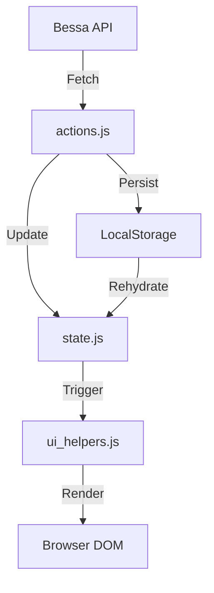

# 🍽️ Kantine Wrapper Bookmarklet

Ein hochmoderner Wrapper für die [Bessa Knapp-Kantine](https://web.bessa.app/knapp-kantine). Dieses Projekt transformiert Standard-API-Daten in eine effiziente Wochenansicht mit Fokus auf Usability und Performance.

---

## 🏗️ System-Architektur

Das Projekt nutzt eine modulare **ES6-Architektur**, die per Webpack gebündelt und als Bookmarklet injiziert wird.

### 🧩 Modul-Verantwortlichkeiten
- **[index.js](file:///config/kantine-wrapper/src/index.js)**: Entry Point. Steuert die Initialisierung und das Polling.
- **[state.js](file:///config/kantine-wrapper/src/state.js)**: Zentrales State-Management (Singleton).
- **[actions.js](file:///config/kantine-wrapper/src/actions.js)**: Business Logic (API-Calls, Cache-Management, Flagging-Logik).
- **[ui.js](file:///config/kantine-wrapper/src/ui.js)** & **[ui_helpers.js](file:///config/kantine-wrapper/src/ui_helpers.js)**: Rendering-Logik und dynamische Komponenten (Tageskarten, Toasts).
- **[events.js](file:///config/kantine-wrapper/src/events.js)**: Zentrales Event-Handling für alle Interaktionen.
- **[i18n.js](file:///config/kantine-wrapper/src/i18n.js)**: Lokalisierung (DE/EN).
- **[api.js](file:///config/kantine-wrapper/src/api.js)**, **[constants.js](file:///config/kantine-wrapper/src/constants.js)** & **[utils.js](file:///config/kantine-wrapper/src/utils.js)**: Infrastruktur, Konstanten und Hilfsfunktionen.

### 🔄 Datenfluss & Cache

**Instant UI Strategy**: Daten werden beim Start sofort aus dem `localStorage` gerendert, während im Hintergrund ein Silent-Refresh die Aktualität sicherstellt.

---

## ⚙️ Build & Release

Das Projekt verwendet zwei Node.js-Skripte für Build und Release:

### `npm run build`

Erzeugt alle Distributionsartefakte aus den Quellen in `src/`:

1. **Webpack** — Bündelt alle ES6-Module zu `dist/kantine.bundle.js`
2. **Minimierung** — Terser minifiziert das Bundle
3. **Bookmarklet** — `dist/bookmarklet-payload.js`, `dist/bookmarklet.txt`
4. **Installer** — `dist/install.html` (mit Changelog und Versionsanzeige)
5. **Standalone** — `dist/kantine-standalone.html` (für UI-Tests mit Mock-Daten)
6. **Smoke-Tests** — Automatisierte Prüfung aller Artefakte, DOM-Tests und Build-Integrität

Der Build läuft vollständig lokal, ohne externe Dependencies außerhalb von `node_modules`.

### `npm run release`

Veröffentlicht den aktuellen Build. Voraussetzung: `npm run build` wurde ausgeführt.

1. **Commit** — `dist/` wird in einem separaten Commit mit Message `chore: update build artifacts for <version>` committet
2. **Tag** — Ein Git-Tag mit der Version aus `version.txt` wird erstellt (`git tag <version>`)
3. **Push** — HEAD und der Tag werden zu `origin` gepusht (Tag per `--force`, damit ein erneuter Release den Tag verschieben kann)

> ⚠️ `npm run release` setzt voraus, dass alle Code-Änderungen (außerhalb `dist/`) bereits committet sind. Das Skript bricht ab, wenn uncommittete Änderungen in `src/`, `version.txt` oder `changelog.md` vorliegen.

### Release-Workflow (üblich)

```
npm run build        # 1. bauen
git add -A           # 2. Code-Änderungen staged
git commit -m "..."  # 3. Code committen
npm run release      # 4. dist/ committen, taggen, pushen
```

---

## 🧠 Kern-Features & Entscheidungen

- **Warum ein Bookmarklet?** Keine Installation erforderlich; nutzt die bestehende Browser-Session des Nutzers.
- **Smart Highlights**: Substring-Matching markiert Favoriten (z.B. "Schnitzel") automatisch.
- **Order History**: Nutzt **Delta-Caching**, um nur neue Bestellungen nachzuladen und die API-Last zu minimieren.
- **Flagging System**: Erlaubt die Überwachung ausverkaufter Menüs mit automatischer In-App Benachrichtigung bei Verfügbarkeit.

---

## 🛡️ Sicherheit & Datenschutz

- **Authentifizierung**: Der Wrapper versucht primär, bestehende Sitzungen („Session Harvesting“) der Bessa-Seite (`AkitaStores`) zu erkennen.
- **Login-Fallback**: Falls keine aktive Sitzung gefunden wird, bietet der Wrapper einen Login-Dialog ([FR-001](file:///config/kantine-wrapper/REQUIREMENTS.md#FR-001)).
- **Passwort-Handling**: **Passwörter werden niemals gespeichert.** Sie werden verschlüsselt an die offizielle Bessa-API übertragen. Nur der resultierende `authToken` wird für die Dauer der Sitzung im `localStorage` persistiert.
- **Transparenz**: Alle Aktionen, die Kosten verursachen (Bestellungen), erfordern eine bewusste Nutzerinteraktion.

---

## 🧪 Entwicklung & Verifizierung

- **Standalone Mode**: `dist/kantine-standalone.html` nutzt `mock-data.js` für UI-Tests ohne API.
- **Automatisierte Tests**: 
  - `node test_logic.js` (Logik)
  - `node tests/test_dom.js` (UI-Interaktionen via JSDOM)
  - `pytest` (Build-Integrität)

---

*Powered by Kaufis-Kitchen & AI Support.*

## ?Y??? Design System

Das UI-Kit und die Design-System-Dokumentation befinden sich im [docs/]-Ordner:
- **[Design System Guide](docs/design-system.md)** (Markdown)
- **[Interaktives UI Kit](docs/kantine-ui-kit.html)** (HTML-Preview)

